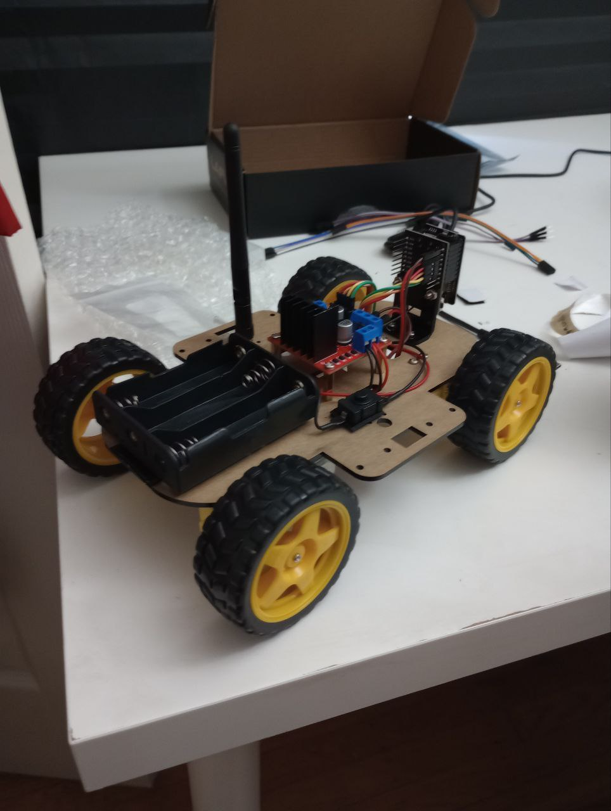

# vision-language-action_robocar

This is the project of integrating the vision-language-action(code) model to a simple $30 robotic car from amazon for autonomous control with the purpose to evaluate the robustness and limits of current models for future use in more complex projects with real world usage. 

Code will be uploaded soon
